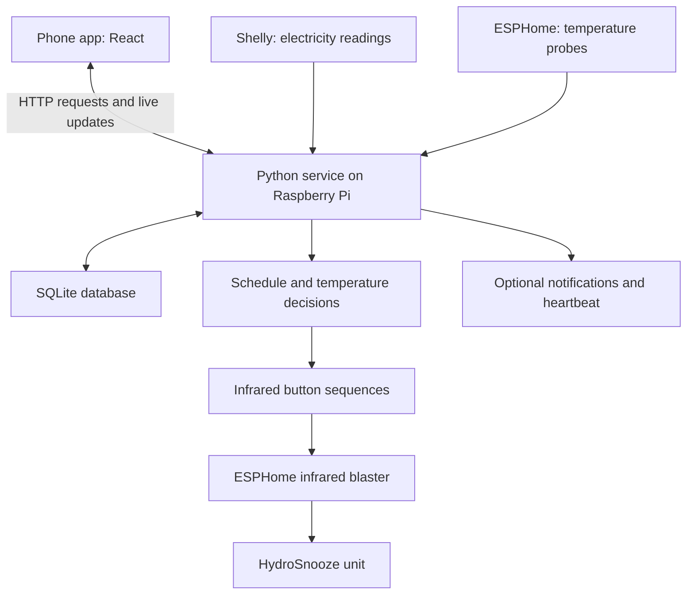

# HydroSnooze repository health report

Reviewed by Codex on 11 September 2026, against commit `c1e445a`.

## Handoff to Claude Code

This document records a repository review and a proposed development plan. It is **not approval to implement the entire plan, deploy changes, or merge into the live branch**. Confirm the current code before fixing a finding: development may have continued since this review.

Liam's working rules:

- The main live branch is `claude/app-fake-transmitter-ghap4w`, even though it is not named `main`.
- All proposed changes must first go through `codex-work`.
- Do not merge or push changes into the live branch without Liam's explicit approval.
- Explain findings and changes in simple language; Liam is not an experienced programmer.
- Do not begin a large rewrite. Prioritise small, reviewable fixes with relevant tests.
- Coordinate ownership between Claude Code and Codex. Separate repository copies do not make it safe to run two controllers against the same hardware.

The review was read-only. Tests and targeted reproductions ran in a temporary copy with simulated hardware. No deployment or live-hardware commands were performed. This report does not verify the current Pi configuration, physical hardware, or GitHub branch protection.

## Overall assessment

The project has a sensible foundation and substantial testing, but several confirmed reliability problems should be fixed before adding more features. A large rewrite is unnecessary.

The strongest parts are the separation between interface, scheduling rules, hardware adapters, and storage; the simulator; interchangeable clocks; and the extensive backend tests.

The highest-priority problems concern shutdown, incorrect assumptions about hardware state, and failures in storage interfering with control. There are also gaps in live connection recovery, report accuracy, deployment, and automated testing across the whole application.

## What the project currently does

HydroSnooze controls a bed cooler/heater through an app that can be opened on a phone.

The user sets bedtime, wake time, and temperatures for the Deep, REM, and Wake portions of the night. These are **scheduled labels, not measurements of actual sleep stages**.

The application:

- Prepares the bed before bedtime, using estimates and previous measurements.
- Changes temperature and cooling/heating mode during the night.
- Tries to switch the unit off at wake time.
- Reads electricity consumption from a Shelly plug.
- Reads water and room temperatures from optional probes.
- Makes temperature-based mode adjustments to favour quieter operation.
- Saves schedules, named profiles, measurements, and event history.
- Shows an Autopilot report and can send notifications.
- Provides a simulator and a compressed test-night rehearsal.

Core control runs locally. Optional notifications use ntfy, and a healthchecks-style external service can report when the controller stops checking in. The Vercel configuration serves a demonstration version with invented data.

The README significantly understates this progress: it still describes missing hardware and, in places, a nonexistent backend.

## Architecture

The phone is the control panel. The Raspberry Pi is the controller that must remain running overnight.

Sending infrared does not prove the unit received it. Electricity readings help verify power state, while probes measure temperatures. Neither directly reads the unit's selected temperature setting.

### Main components and important files

Paths below are relative to the repository root. Links work when this report is viewed in its `docs/` location.

| Component | Important files | Responsibility |
|---|---|---|
| Phone interface | [frontend/src/App.tsx](../frontend/src/App.tsx), `frontend/src/screens/`, `frontend/src/components/` | Screens, controls, charts, errors |
| Phone/server connection | [frontend/src/api/http.ts](../frontend/src/api/http.ts), [frontend/src/useService.ts](../frontend/src/useService.ts) | Requests and live updates |
| Web service and API | [backend/hydrosnooze/main.py](../backend/hydrosnooze/main.py), [api/routes.py](../backend/hydrosnooze/api/routes.py), [api/schemas.py](../backend/hydrosnooze/api/schemas.py) | Starts the app, serves pages, receives commands, serialises data |
| Central controller | [backend/hydrosnooze/service.py](../backend/hydrosnooze/service.py) | Coordinates hardware, state, background work, and recovery |
| Scheduling rules | [models.py](../backend/hydrosnooze/models.py), [scheduler.py](../backend/hydrosnooze/scheduler.py) | Calculates stages and decides which action is due |
| Hardware commands | [sequences.py](../backend/hydrosnooze/sequences.py), [adapters/](../backend/hydrosnooze/adapters/) | Sends infrared and reads hardware |
| Storage | [db.py](../backend/hydrosnooze/db.py) | SQLite storage and upgrades |
| Reports and alerts | [autopilot.py](../backend/hydrosnooze/autopilot.py), [report.py](../backend/hydrosnooze/report.py), [notify.py](../backend/hydrosnooze/notify.py) | Night summaries, notifications, heartbeat |
| Configuration | [config.py](../backend/hydrosnooze/config.py), [backend/.env.example](../backend/.env.example) | Hardware selection, addresses, timing, limits, and storage settings |
| Installation and deployment | [scripts/deploy.sh](../scripts/deploy.sh), [scripts/install.sh](../scripts/install.sh), [docs/hydrosnooze.service](hydrosnooze.service) | Copies software to the Pi and runs it automatically |

### Database and dependencies

SQLite contains six application tables:

- `schedule`: the current saved schedule.
- `profiles`: named snapshots of stage settings.
- `events`: actions, warnings, and errors.
- `power_samples`: electricity and temperature readings.
- `fired_jobs`: markers used to avoid repeating jobs after restart.
- `precondition_runs`: previous bed-preparation results used for learning.

The main software dependencies are React, TypeScript, Vite, FastAPI, Uvicorn, Pydantic, HTTPX, and `aioesphomeapi`. SQLite comes with Python. Linux systemd provides automatic startup and restart monitoring.

The API includes schedule, state, health, history, profiles, temperature, mode, power, rehearsal, and notification endpoints. `/api/live` supplies WebSocket updates. Simulator controls are guarded to reject use when the service is not simulated.

## How data flows

When the user changes a scheduled temperature:

1. The phone sends a request to the Python API.
2. The API checks the input, including temperature limits.
3. The service saves the schedule in SQLite.
4. A live message updates connected phones.
5. At the appropriate stage boundary, the scheduler requests the hardware change.

An immediate temperature adjustment follows the command path straight away. During a running stage, that adjustment can also update the saved temperature for future nights.

Hardware commands share a lock: only one sequence runs at a time. This is essential because mixing sequences would produce the wrong button presses.

Separately, the service collects measurements, updates the phone, stores history, and evaluates whether a quieter mode is appropriate.

## Structure and maintainability

The overall organisation is appropriate for this project. The simulator and interchangeable clocks allow overnight behaviour to be tested in seconds. Other strengths include temperature checks at both API and command layers, retry delays, stale-probe detection, persistent job markers, and process recovery.

The main structural pressure point is `service.py`, at approximately 1,700 lines. It handles many responsibilities, increasing the chance that a local change affects scheduling, reporting, or hardware behaviour elsewhere. Gradual extraction would help later; moving everything now would make the confirmed bugs harder to fix safely.

Some duplication is intentional, such as real and simulated hardware implementations. The mock frontend is also useful for the demonstration site. These should not be deleted simply because they resemble production code.

## Verification performed

| Check | Result |
|---|---|
| Backend tests | **538 passed** |
| Frontend production build | **Passed** |
| TypeScript check | **Passed** |
| Basic Python lint check | 10 findings, primarily in tests and utility scripts |
| Frontend dependency audit | Two affected packages: Vite and esbuild |
| Live hardware acceptance | Not performed |

One test initially failed because macOS's temporary socket path was too long; the sandbox then blocked socket creation. With a shorter path and permission for the local test socket, the entire suite passed. This was an execution-environment issue, not evidence of a failed application test.

The backend suite covers temperature sequences, delayed plug readings, retries, reconnection, restart markers, probes, profiles, learning, migrations, reports, and shutdown.

There was no HTTP-route integration suite, WebSocket integration suite, or automated frontend test suite found at the reviewed commit. Passing the existing tests therefore does not establish end-to-end reliability.

### Targeted reproductions beyond the existing suite

These checks exercised the reviewed code with simulated devices or substituted failures. They do not claim the same events were observed on the real unit.

| Scenario | Observed result |
|---|---|
| Disable a running schedule, then advance to its former wake time | No shutdown job; simulated unit still on |
| Ask for power on while the plug is unavailable and the unit is already on | The power toggle switched the simulated unit off |
| Change the physical-mode state outside the app, then request 20°C in quiet mode | App assumed quiet/20°C; simulated unit ended warming/33°C |
| Issue a standalone mode command after setting 30°C | App still assumed 30°C; simulated target was 28°C |
| Mark an overdue stage missed, then build its report | The missed stage was counted among landed stages |
| Overflow a live-update subscriber queue, drain it, then send another update | Subscriber had been removed and received no new update |
| Fail a schedule database save | Running schedule changed while stored schedule remained unchanged |
| Return HTTP 503 from a substituted notification server | Notification test still returned success |
| Subscribe, unsubscribe, then resubscribe using the same frontend HTTP client | No new socket; client remained permanently closed |
| Interrupt migration before the old schedule was saved into the new table | Restart loaded default temperatures `17/20/26` instead of `19/21/26`; old table remained |
| Fail event storage before scheduled shutdown | Shutdown aborted before sending its command; simulated unit stayed on |
| Calculate an eight-hour night across the October UK clock change in the browser | Browser bedtime differed by one hour from backend local-time arithmetic |

## Prioritised development plan

### Critical problems to fix now

#### C1. Preserve shutdown even when the schedule changes

**Problem:** Disabling a schedule removes it from the scheduler immediately. It does not switch off the unit or preserve the current night's shutdown. Removing the selected wake day or all stages has the same underlying risk. Failed rehearsal shutdown also loses its rehearsal plan, preventing the normal retry path from continuing for that rehearsal.

**Why it matters:** The controller can leave a running unit without its planned shutdown.

**Change:** Track the running night and its outstanding shutdown separately from settings for future nights. Explicitly define what disabling automation and stopping a rehearsal mean.

**Difficulty/risk:** Medium–high; changes core scheduling.

**Suggested lead:** Codex, with human approval of the intended behaviour and supervised hardware verification.

**Code:** `Scheduler.plan_in_progress`, `Service.update_schedule`, `Service._run_job`, and rehearsal lifecycle methods.

#### C2. Stop assuming the physical remote has left the mode unchanged

**Problem:** The service sometimes skips setting a mode because it remembers setting it previously. The physical remote can invalidate that memory. Standalone mode commands can also alter the temperature through preliminary button presses while retaining an incorrect displayed target.

**Why it matters:** A command can leave the unit in the wrong mode and at the wrong temperature while the app displays the requested values.

**Change:** Establish the intended mode reliably before setting temperature. Following standalone mode changes, restore a valid target or clear the displayed assumption.

**Difficulty/risk:** Medium–high; sequence tests and hardware checks are necessary.

**Suggested lead:** Codex; human verifies behaviour using the physical remote.

**Code:** `Service._apply`, `Service.set_temperature`, `Service.set_mode`, and `Commands.set_mode`.

#### C3. Handle an unreachable plug consistently before automatic power commands

**Problem:** The stage-transition path avoids pressing power when the plug cannot be read. However, `Commands.power_on()` still presses it in that situation, and preconditioning uses that method.

**Why it matters:** A power button is a toggle. Asking to turn on can switch an already-running unit off when its state is unknown.

**Change:** Give automatic power operations an explicit unknown-state policy. Do not treat missing measurements as evidence that the unit is off.

**Difficulty/risk:** Medium; touches power recovery behaviour.

**Suggested lead:** Codex, followed by human hardware acceptance.

**Code:** `Commands.power_on`, `Commands.power_off`, `Service._run_precool`, and `Service._run_stage`.

#### C4. Prevent failed logging from blocking shutdown

**Problem:** Database event logging runs directly inside the command path. A failed event write can stop the action. A simulated full disk aborted shutdown while recording its opening log message.

**Why it matters:** Diagnostic storage should not prevent an essential hardware action.

**Change:** Allow essential control actions to continue when diagnostic storage fails. Report the storage fault through an independent fallback, and test disk-full behaviour.

**Difficulty/risk:** Medium; exception handling needs care.

**Suggested lead:** Codex.

**Code:** `EventLog.add`, `Service._on_event`, and `Service._run_power_off`.

#### C5. Verify the independent Shelly shutdown protection

**Problem:** The checklist still marks the plug's daily off/on schedule as unconfirmed. The application reads the plug but does not configure that protection.

**Why it matters:** A stopped Pi cannot issue shutdown commands.

**Change:** Verify the actual plug schedule and record a supervised test proving it works when the controller is unavailable. Confirm the times suit the current routine. The documented proposal is 09:00 off and 19:00 on; this review does not establish that it is configured.

**Difficulty/risk:** Low software complexity; physical verification required.

**Suggested lead:** Human. Neither assistant should mark this complete from repository comments alone.

**Evidence:** [CHECKLIST.md](../CHECKLIST.md), especially the outstanding Shelly schedule items.

### Important improvements

| ID | Problem and why it matters | Recommended change | Difficulty / risk | Suggested lead |
|---|---|---|---|---|
| I1 | Live updates can stop permanently. Unsubscribing sets the HTTP client's `closed` flag permanently; React's development checks exercise setup and cleanup. | Make connection setup reusable; test unsubscribe/resubscribe and reconnection. Keep Strict Mode enabled. | Low–medium | Codex |
| I2 | A slow phone can silently lose updates. A full server queue removes the subscriber without closing its socket; it can later receive keepalives but no state updates. | Close or resynchronise slow connections; refetch a complete snapshot after reconnecting. | Medium | Codex |
| I3 | Loading and history recovery are incomplete. Initial requests lack failure recovery; history is fetched once and its refresh function is unused. Initial live schedule calculations also differ from the normal endpoint. | Add loading errors/retry, refresh history on return/reconnect, and use one schedule representation. | Medium | Codex |
| I4 | Reports can misrepresent events. Missed and successful stages share a marker; historical plans are reconstructed from today's editable schedule. | Store distinct success/missed/failed outcomes and the plan actually used for each night. Bound all report measurements to that night. | Medium–high; storage changes | Codex |
| I5 | Notification tests can claim success after delivery failure. Some hardware endpoints also return HTTP success after internally recording command failure. | Check notification HTTP responses, return meaningful command failures, and distinguish configured alerts from successfully tested delivery. | Low–medium | Codex |
| I6 | Database upgrades are not interruption-safe. Failed saves can also leave the running schedule different from the stored schedule. | Make upgrades transactional/recoverable; back up before upgrading; save successfully before adopting a schedule in memory. | Medium–high | Codex |
| I7 | Local controls have no authentication. Anyone who can reach the API can operate the unit; the blaster's debug webpage also exposes controls. | Decide the trusted-network boundary; restrict access and protect or disable unnecessary device controls. Check firmware-update access too. | Medium; depends on network setup | Human with Codex |
| I8 | Development dependencies have known advisories. The audit reported Vite and esbuild as affected. | Upgrade deliberately and test development and production builds. Avoid automatic forced upgrades. | Medium | Codex |
| I9 | Deployment copies files into the running installation. Interruption can leave mixed versions; the script does not install changed Python dependencies, run tests, or provide automatic rollback. | Deploy a tested, identified release; include dependency installation, backup, health verification, and a rollback route. | Medium–high | Codex; human approves deployment |
| I10 | Browser and backend time calculations differ. They can disagree across UK clock changes. | Define clock-change behaviour, calculate authoritative timestamps on the server, and add daylight-saving tests. | Medium–high | Codex |
| I11 | Documentation and working rules have drifted. No repository `AGENTS.md` records Liam's branch policy. | Reconcile README, checklist, roadmap, and comments; document branch approval rules and restrictions on real-hardware use. | Low | Codex; human confirms deployment facts |
| I12 | Good backend unit tests do not cover the complete phone-to-hardware path, and no repository CI workflow was found. | Add focused integration/frontend tests and an automatic GitHub check for backend tests and the frontend build on proposed changes. | Medium / low | Codex |
| I13 | Python dependencies use broad minimum versions without a lockfile. A fresh installation can differ from the tested Pi environment. | Record and reproduce the tested dependency set, including hardware dependencies, as part of release preparation. | Medium | Codex |

The dependency advisories concern development tooling; they do not establish that the Pi's static production frontend has the same exposure. Some reported issues are Windows-specific. The Vite source-map traversal advisory has broader relevance. Advisory status and compatible upgrade choices should be checked again when implementing I8.

### Most important missing tests

1. The confirmed shutdown, remote-mode, missing-plug, and storage-failure reproductions above.
2. Actual API requests covering validation, temperature limits, and command failures.
3. Browser tests for initial connection, reconnect, failed saves, rapid edits, and fresh history.
4. Reports spanning missed stages, schedule edits, and subsequent nights.
5. Interrupted migrations and backup restoration.
6. Clock changes and slow-command interaction with the watchdog.
7. Test setup that explicitly forces simulation regardless of a developer's `.env`.

Human-observed hardware checks remain necessary for infrared changes. Tests against the simulator can only verify the hardware behaviours that the simulator models correctly.

### Features currently being developed

This status is inferred from recent commits and the roadmap, not another assistant's current task.

| Area | Current position and recommended next step | Difficulty / risk | Suggested lead |
|---|---|---|---|
| Blaster reliability | Scheduled pre-night reboot is already implemented, despite the roadmap saying otherwise. Receiver-based transmission checking remains an experiment. Test it before relying on it: hearing the local transmitter still would not prove the bed received the command. | Medium–high; hardware | Claude Code if continuing that work, with human observation |
| Autopilot reporting | Recently expanded with charts and adjustment attribution. Fix outcome/history accuracy before extending metrics. | Medium | Codex |
| Probe-based quiet operation and learning | Implemented, with extensive tests. Validate behaviour over real nights and preserve measured calibration. | Medium–high | Human with one designated assistant |
| Long-term history | Retention is now five years, but the ordinary history screen shows 24 hours and the API limits its history request to a week. Add historical browsing after report correctness is settled. | Medium | Either assistant, assigned exclusively |

There are few conventional TODO markers. Most unfinished work is recorded in prose or unchecked checklist items. Some unchecked items are alternative troubleshooting branches and should not all be treated as outstanding tasks.

The frontend mock is intentional demonstration code. Preconditioning has explicitly labelled assumptions when measurements or learned history are unavailable. Autopilot's sleep-improvement boosts are explicitly invented, user-requested figures with a disclaimer; they are not measured sleep outcomes.

### Nice-to-have improvements

| Recommendation | Why and what to change | Difficulty / risk | Suggested lead |
|---|---|---|---|
| Gradually shorten `service.py` | Extract coherent reporting or health responsibilities after behaviour is covered. This reduces accidental cross-effects. | Medium / medium | Codex |
| Remove proven duplication and obsolete helpers | Energy calculation is duplicated in `report.py` and `autopilot.py`. There are unused helpers and outdated temperature-mode descriptions. Consolidate narrowly with tests. | Low / low | Either assistant |
| Improve offline behaviour only if useful | Service-worker caching exists, but the documented phone URL uses plain HTTP. Service workers normally require a secure context, so the promised offline shell will not generally work there. Evaluate local HTTPS before expanding caching. | Medium / medium | Codex plus human |
| Improve save feedback | Optimistic edits can remain visible after failure, and rapid requests can overwrite newer intent. Show pending/failed saves and reconcile the confirmed server result. | Medium / low–medium | Codex |

### Things that should not be changed yet

| Keep for now | Reason and future approach | Change risk / owner |
|---|---|---|
| SQLite and the single controller process | Appropriate for one household appliance. Extra services or a larger database add operational burden without a demonstrated need. | High unnecessary disruption; technical-lead decision |
| Measured infrared timings, rail counts, power thresholds, and retry delays | These encode hardware discoveries. Shortening a wait or adding a power press can reverse the intended outcome. Change only with targeted tests and observation. | High; human plus designated assistant |
| The command lock and simulator | They prevent mixed commands and make safe testing possible. Preserve both during fixes. | High if removed; either assistant must respect this |
| The local-controller deployment model | Hardware control and overnight scheduling need the always-running controller. Keep the hosted demonstration separate. | High architectural risk |
| Existing user-chosen “for fun” boosts | These are explicitly invented metrics with a disclaimer. Do not silently present them as measured sleep improvements or remove them without a product decision. | Low technical, meaningful product change; human decides |
| Git history and the live branch | Avoid broad cleanup, branch renaming, or history rewriting during reliability work. | Coordination risk; explicit human approval |

## Coordination risks for Claude Code and Codex

The highest-risk shared areas are:

- **`models.py`, `scheduler.py`, `service.py`, and `sequences.py`:** one behaviour crosses all four.
- **Python API shapes and TypeScript types:** changing a field on one side can break the phone without failing Python tests.
- **Database upgrades:** copying new code over an older installation must preserve real schedules and history.
- **Firmware button names:** Python, ESPHome YAML, and capture tools must agree.
- **Notification wording:** some alert decisions match phrases in messages, so copy-editing can change whether an alert is sent.
- **Real-device settings:** separate Git copies do not prevent two running controllers from sending conflicting commands.
- **Deployment scripts:** they can update the Pi directly, regardless of whether code has been merged into the live branch.

There is no inherent reason to assign a subsystem permanently to one model. One assistant should own each change, the other can review it, and Liam should approve releases. The suggested leads above are a proposed division of work, not an instruction to begin work in another task.

## Recommended next steps

1. Verify the Shelly's independent shutdown protection with a supervised physical check.
2. Agree the intended behaviour when automation is disabled during a running night.
3. Implement C1–C4 as small, separately reviewable fixes with reproducing tests.
4. Address connection recovery, truthful command/notification results, database recovery, and report accuracy.
5. Establish automatic checks and a reproducible, recoverable deployment process.
6. Continue features after the reliability fixes have passed relevant tests and supervised acceptance.

Keep all proposed implementation on `codex-work` until Liam explicitly approves promotion to `claude/app-fake-transmitter-ghap4w`, the main live branch. Do not deploy merely because tests pass.

## External references checked during the review

- [React Strict Mode](https://react.dev/reference/react/StrictMode): documents development setup/cleanup checks relevant to the live-client lifecycle bug.
- [Vite source-map path traversal advisory](https://github.com/vitejs/vite/security/advisories/GHSA-4w7w-66w2-5vf9): an advisory returned by the dependency audit.
- [Service Worker API](https://developer.mozilla.org/en-US/docs/Web/API/Service_Worker_API): documents secure-context requirements relevant to the local HTTP deployment.

Repository findings above are based on the reviewed code and the verification described here. They should be rechecked against newer commits before implementation.
